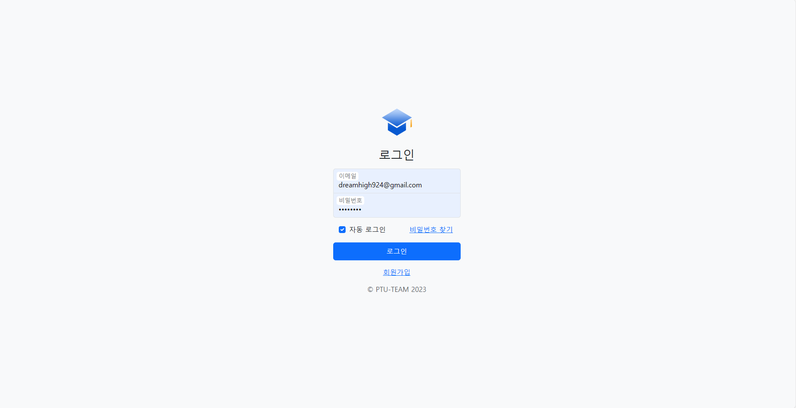

# PTU\_TEAM Repository Overview

평택대 졸업 작품 프로젝트

## 프로젝트 개요

*   주제

    대학생들이 정보를 공유하고 소통할 수 있는 커뮤니티 사이트

## 주요 기능

* 회원가입 및 로그인
* 게시판 기능 (CRUD)
* 댓글 기능 (CRUD)
* 키워드 검색
* 조회수 및 좋아요 조회

## 기술 스택

*   통합 개발 환경

    
*   프론트 엔드

       
*   백엔드

       
*   데이터베이스

    
*   빌드 도구

    
*   서버

     

## 멤버 구성

* 박승호(팀장) : Back-end, Front-End
* 박현영 : Markup (Publishing)
* 성지현 : UI Design
* 이성연 : Markup (Publishing)

## 개발 기간

* 2024년 10월 1일 \~ 2024년 11월 28일

## 화면 구성

<figure><figcaption>
로그인 화면
</figcaption></figure>

<figure><figcaption>
회원가입 화면
</figcaption></figure>

<figure><figcaption>
홈 화면
</figcaption></figure>

<figure><figcaption>
게시판 화면
</figcaption></figure>

<figure><figcaption>
게시글 쓰기 화면
</figcaption></figure>

<figure><figcaption>
게시글 조회 화면
</figcaption></figure>

<figure><figcaption>
댓글 작성 화면
</figcaption></figure>

<figure><figcaption>
게시글 검색 화면 1
</figcaption></figure>

<figure><figcaption>
게시글 검색 화면 2
</figcaption></figure>

<figure><figcaption>
게시글 정렬 1
</figcaption></figure>

<figure><figcaption>
게시글 정렬 2
</figcaption></figure>

<figure><figcaption>
게시글 정렬 3
</figcaption></figure>

## 시스템 아키텍쳐

* Service Flow

  

* Application Architecture

  

## 배포

*   도메인

    [http://connects.kro.kr/](http://connects.kro.kr/)
